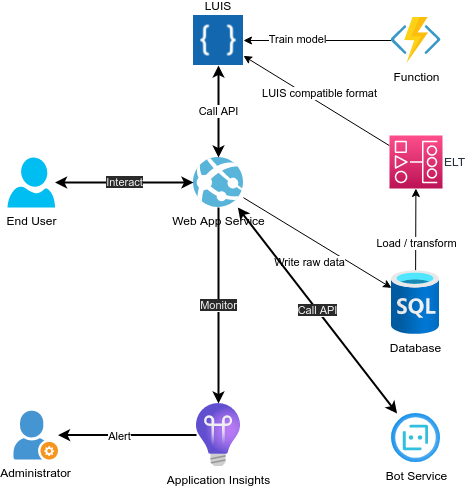

### Target performance management policy

In order to achieve the target performance, the following policy must be implemented :

-   **store** each dialogs and inferred _intents_ and _entities_ in a _database_
-   **transform and load** (ETL) the raw data in a _datawarehouse_ in a _format compatible with the LUIS service_
-   daily **re-train** the _language understanding model_ with the new _intents_ and _entities_ of the **successful** bookings

---

### Target production architecture

