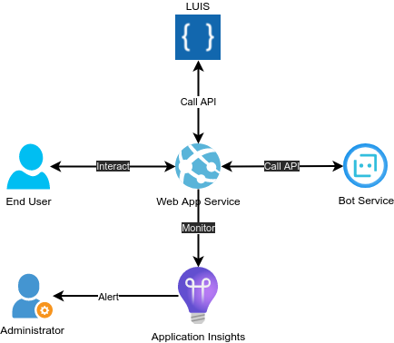

<!-- _class:  lead -->


# Fly Me

## Flights booking chatbot

---

### Challenge

**Fly Me** is a travel agency offering _flight booking services_ for private or professional customers.

In order to make the booking process easier, we want to automate it with a **chatbot**.
To be efficient, the bot must be able to :

-   **interact** with the user in a natural way
-   recognize the user's **intent** (book a flight, ...)
-   recognize the desired **caracteristics** of the trip (origin and destination cities, ...)
-   **ask** for more information if necessary
-   allow the user to **cancel** the booking process
-   raise an **alert** if the booking process fails too often

---

### Goals

In this project, we are going to :

-   deploy a **chatbot** in the _cloud_
-   train a **language understanding** model
    -   in order to _infer_ the user's intent and trip caracteristics from the user's input
-   implement **unit and integration tests**
    -   to ensure that the chatbot is _working as expected_
-   monitor the chatbot's **performance**
    -   raise an _alert_ in case of recurring issues

---

### Exploratory data analysis

For this MVP, we used the [Azure Frames Dataset](https://www.microsoft.com/en-us/research/project/frames-dataset/ "Azure Frames Dataset") :

-   **1369 dialogues** between a human and a bot, composed of **~15 turns** on average
-   the bot can :
    -   **ask** the user for information
    -   **suggest** a trip to the user
    -   ask the user to **confirm**
-   the user can :
    -   ask the bot for **suggestions**
    -   **inform** the bot about relevant information
    -   **cancel** or **confirm** the trip

---

### Dialog example

```
0 - user says :
"Can you get me to Kyoto"
Known facts :
{'intent': 'book', 'dst_city': 'Kyoto'}

1 - wizard says :
"Ok! From where?"
Known facts :
{'intent': 'book', 'dst_city': 'Kyoto'}

2 - user says :
"I need to be there for at least four days"
Known facts :
{'intent': 'book', 'dst_city': 'Kyoto', 'min_duration': '4'}

3 - wizard says :
"Have you a budget?"
Known facts :
{'intent': 'book', 'dst_city': 'Kyoto', 'min_duration': '4'}

4 - user says :
"I’m on the road so I can head there from any origin point. Budget is 3500"
Known facts :
{'intent': 'book', 'dst_city': 'Kyoto', 'min_duration': '4', 'or_city': '-1', 'budget': '3500.0'}

5 - wizard says :
"Travelling alone?"
Known facts :
{'intent': 'book', 'dst_city': 'Kyoto', 'min_duration': '4', 'or_city': '-1', 'budget': '3500.0'}

6 - user says :
"two adults. oh and please find me a place near a park"
Known facts :
{'intent': 'book', 'dst_city': 'Kyoto', 'min_duration': '4', 'or_city': '-1', 'budget': '3500.0', 'park': True, 'n_adults': '2'}

7 - wizard says :
"I can get you 4 days in Kyoto for 1857.63USD if you leave from Sapporo."
Known facts :
{'intent': 'book', 'dst_city': 'Kyoto', 'min_duration': '4', 'or_city': 'Sapporo', 'budget': '3500.0', 'park': True, 'n_adults': '2', 'duration': '4', 'price': '1857.63'}
...
```

---

### Step 1 : LUIS Model training and deployment

The first step in this project was to train and deploy a **language understanding** model using the [LUIS](https://www.luis.ai/) _natural language service_ :

-   create an **Azure LUIS** resource
    -   add the **intents** and **entities** to the _LUIS model_
-   **format** the _raw data_ to be compatible with Azure LUIS
    -   add the **examples** to the LUIS model
-   run the LUIS model **training**
-   **deploy** the model to the _cloud_

---

### Step 2 : chatbot development and deployment

The second step in this project was to develop and deploy a **Chatbot** :

-   create a **Bot Service** resource
-   implement the bot with the **Bot Framework SDK**
    -   implement _dialogs_ : welcome, gather intention, ask informations, confirm, cancel, ...
    -   integrate the _LUIS service_
    -   add _unit and integration tests_
        -   test the _LUIS service_
        -   test the LUIS service _integration_
        -   test a _standard dialog_
-   deploy the bot to the **Azure Web App**

---

### Step 3 : chatbot monitoring

The final step in this project was to monitor the **chatbot's performance** :

-   create a **Application Insights** resource
-   log a **Telemetry trace** every time the bot is used (`booking_accepted` or `booking_refused`)
-   add an **Alert** if the bot fails too often :
    -   if _More than 5 Booking Refused last 5 minutes_
    -   then _Send Email and SMS to admins_

---

### Curent MVP System Architecture



---

### Resources inventory

| **LUIS**                                                                                                                                                                                                                                    | **Chatbot**                                                                                                                                                                                                                            | **Monitoring**                                                                                                                                                                                                                                                                                                                            |
| ------------------------------------------------------------------------------------------------------------------------------------------------------------------------------------------------------------------------------------------- | -------------------------------------------------------------------------------------------------------------------------------------------------------------------------------------------------------------------------------------- | ----------------------------------------------------------------------------------------------------------------------------------------------------------------------------------------------------------------------------------------------------------------------------------------------------------------------------------------- |
| [Language understanding model](https://www.luis.ai/applications)                                                                                                                                                                            | [Bot service](https://portal.azure.com/#@clementfleurypm.onmicrosoft.com/resource/subscriptions/da2e4791-6dd1-422b-848a-a961cef6ab89/resourceGroups/OC_P10_Bot/providers/Microsoft.BotService/botServices/fly_me/overview)             | [Application Insights](https://portal.azure.com/#@clementfleurypm.onmicrosoft.com/resource/subscriptions/da2e4791-6dd1-422b-848a-a961cef6ab89/resourceGroups/OC_P10_Bot/providers/microsoft.insights/components/ocp10-appinsights/overview)                                                                                               |
| [Authoring resource](https://portal.azure.com/#@clementfleurypm.onmicrosoft.com/resource/subscriptions/da2e4791-6dd1-422b-848a-a961cef6ab89/resourceGroups/OC_P10/providers/Microsoft.CognitiveServices/accounts/ocp10-luis-auth/overview)  | [App Service Plan](https://portal.azure.com/#@clementfleurypm.onmicrosoft.com/resource/subscriptions/da2e4791-6dd1-422b-848a-a961cef6ab89/resourceGroups/OC_P10_Bot/providers/Microsoft.Web/serverFarms/ocp10-bot-plan/webHostingPlan) | [Alert Rule](https://portal.azure.com/#view/Microsoft_Azure_Monitoring/UpdateLogSearchV2AlertRuleViewModel/alertId/%2Fsubscriptions%2Fda2e4791-6dd1-422b-848a-a961cef6ab89%2FresourceGroups%2FOC_P10_Bot%2Fproviders%2Fmicrosoft.insights%2Fscheduledqueryrules%2FWARNING%20-%20More%20than%205%20Booking%20Refused%20last%205%20minutes) |
| [Prediction resource](https://portal.azure.com/#@clementfleurypm.onmicrosoft.com/resource/subscriptions/da2e4791-6dd1-422b-848a-a961cef6ab89/resourceGroups/OC_P10/providers/Microsoft.CognitiveServices/accounts/ocp10-luis-pred/overview) | [App Service](https://portal.azure.com/#@clementfleurypm.onmicrosoft.com/resource/subscriptions/da2e4791-6dd1-422b-848a-a961cef6ab89/resourceGroups/OC_P10_Bot/providers/Microsoft.Web/sites/ocp10-bot-webapp/appServices)             | [Monitoring Dashboard](https://portal.azure.com/#@clementfleurypm.onmicrosoft.com/dashboard/private/41e0e40e-2469-4ecf-91c6-d576b3787015)                                                                                                                                                                                                 |

---

### Demo

| **Demo** | **Monitoring** |
|:--------:|:------:|
|  |  |


---

### Next steps

-   **integrate** the bot with multiple _Channels_ (Website, Discord, Teams, Slack, ...)
-   **improve** the bot capacity to handle more _Intentions_ and _Entities_
-  **connect** the bot to an actual _Flight booking_ system
-  **monitor** more precisely the bot's performance : _errors_, _performance_, _availability_, ...

---

<!-- _class:  lead -->

# Fly Me

## Flights booking chatbot

[](https://github.com/fleuryc/OC_AI-Engineer_P10_Flights-booking-chatbot "Fly Me : flights booking chatbot")
